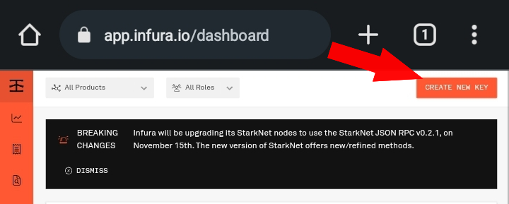
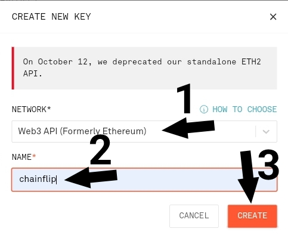
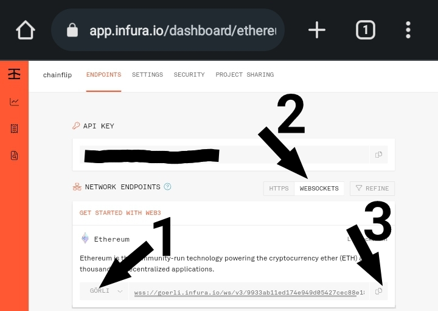

# Chainflip node installation
### Officil link
* Website: https://chainflip.com
* Official docs: https://docs.chainflip.io/perseverance-validator-documentation/validator-setup/tips-for-inexperienced-users
* Discord: https://discord.gg/w6rCpACk

### Server VPS minimum yang di butuhkan
| System         | Requirement                                                           |
| -------------- | ---------------------------------------------------------------       |
| OS             | Ubuntu 20.04 - PLEASE ONLY USE THIS OS.                               |
| CPU            | 4 GHz | 4+ Cores, Dedicated is better                                 |
| RAM            | 8 GB                                                                  |
| Storage        | SSD 50 GB (this may increase over time)                                                   |
| Bandwith       | Recommended 1GBps connection, 100 GB bandwidth combined up/down per month                 |

### Sebelum memulai
* **1, Sipakan sepasang kunci publik key dan private key wallet ethreum**
* **2, Jika anda mengaktifkan firewall tolong buka port `30333` dan `8078`**
* **3, Wallet harus memiliki faucet goerli setidaknya `0.1 gETH` Dan token testnet flip atau `tFLIP` silahkan ambil di discordnya**
Link faucet goerli: https://faucet.paradigm.xyz
* **4, Harus memiliki akun infura atau alchemy ethereum client api**
Untuk saat ini kita menggunakan infura untuk ethereum clienntnya
- 1. Buat akun atau login
**https://app.infura.io/dashboard**
**https://dashboard.alchemy.com**/
**Contoh di sini saya menggunakan akun infura**
- 2. Setelah masuk ke dashboard klik `Create new key`

- 3. Isi nama dan pilih network Web3 API (Ethereum formerly) lalu klik create

- 4. Pilih jaringan goerli dan koneksi websocket


## Auto installation
```
bash -c "$(curl -sSL https://raw.githubusercontent.com/jambulmerah/guide-testnet/main/chainflip/chainflip.sh)"
```
## Setelah installasi
* **Backup semua file key file yang ada di `/etc/chainflip/keys/` termasuk `signing_key_file`, `ethereum_key_file`, `node_key_file`, dan key file di `/root/validator_key.json`**
* **Check log**
```
tail -f /var/log/chainflip-node.log
```
* Anda akan melihat sesuatu seperti ini
```
⚙️ Syncing 105.0 bps, target=#10997, best: #10557 (0x97d4…f396), finalized: #10245 (0xb6b0…1551), ⬇ 1.4kiB/s ⬆ 1.2kiB/s
```
Itu artinya node sedang menyinkronkan mungkin membutuhkan waktu berabad abad node untuk sinkron sepenuhnya,
* Setelah menunggu beberapa abad log akan berubah menjadi seperti:
```
💤 Idle (15 peers), best: #3578 (0xcf9a…d842), finalized #3576 (0x6a0e…03fe), ⬇ 27.0kiB/s ⬆ 25.5kiB/s 
✨ Imported #3579 (0xa931…c03e)
```
Itu artinya node telah sinkron penuh dan mulai mengimport block
## Setalah node sinkron sepenuhnya
* Jika node telah sinkron penuh jalankan perintah:
```
sudo systemctl start chainflip-engine
```
* Cek status perintah:
```
sudo systemctl status chainflip-engine
```
* Lihat log kembali
```
tail -f /var/log/chainflip-engine.log
```
# Dahlah segitu dulu😁
