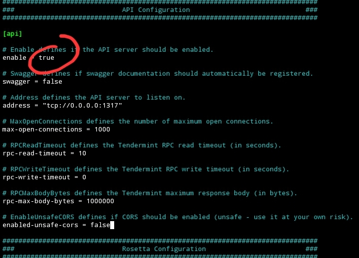

# Cara deploy pingpub expoler + reverse proxy nginx
## Yang di butuhkan
- **Domain explorer dan vps webserver untuk hosting explorernya**
- **Subdoaamin rpc dan api nya**
- **Nginx buat reverse proxy**
- **Repo ping pub buat deploy explorernya**

## Di node API nya jadiin true

- **Kalo udah di truein restart nodenya**
## Install paket yang di butihkan
```
sudo apt update && sudo apt upgrade -y
sudo apt install nginx certbot python3-certbot-nginx -y
curl -fsSL https://deb.nodesource.com/setup_16.x | sudo -E bash -
sudo apt-get install -y nodejs git
curl -sL https://dl.yarnpkg.com/debian/pubkey.gpg | gpg --dearmor | sudo tee /usr/share/keyrings/yarnkey.gpg >/dev/null
echo "deb [signed-by=/usr/share/keyrings/yarnkey.gpg] https://dl.yarnpkg.com/debian stable main" | sudo tee /etc/apt/sources.list.d/yarn.list
sudo apt-get update && sudo apt-get install yarn -y

```
## reverse proxy nginx + install ssl
##### 1. Config API
```
nano /etc/nginx/sites-enabled/<YOUR.API.SUBDOMAIN.SITE>.conf
```
##### 2. Copy seperti di bawah ini
```
server {
    server_name YOUR.API.SUBDOMAIN.SITE;
    listen 80;
    location / {
        add_header Access-Control-Allow-Origin *;
        add_header Access-Control-Max-Age 3600;
        add_header Access-Control-Expose-Headers Content-Length;

	proxy_set_header   X-Real-IP        $remote_addr;
        proxy_set_header   X-Forwarded-For  $proxy_add_x_forwarded_for;
        proxy_set_header   Host             $host;

        proxy_pass http://YOUR_API_NODE_IP:1337;

    }
}

```
- ** `YOUR.API.SUBDOMAIN.SITE` ganti dengan subdomain api anda `http://YOUR_API_NODE_IP:1337` ganti dengan ip node dan port apinya sesuaikan yg di node**
##### 3. Config RPC
```
nano /etc/nginx/sites-enabled/<YOUR.RPC.SUBDOMAIN.SITE>.conf
```
##### 4. Copy seperti di bawah ini:
```
server {
    server_name YOUR.RPC.SUBDOMAIN.SITE;
    listen 80;
    location / {
        add_header Access-Control-Allow-Origin *;
        add_header Access-Control-Max-Age 3600;
        add_header Access-Control-Expose-Headers Content-Length;

	proxy_set_header   X-Real-IP        $remote_addr;
        proxy_set_header   X-Forwarded-For  $proxy_add_x_forwarded_for;
        proxy_set_header   Host             $host;

        proxy_pass http://YOUR_RPC_NODE_IP:26657;

    }
}

```
- ** `YOUR.RPC.SUBDOMAIN.SITE` ganti dengan subdomain rpc anda `http://YOUR_API_NODE_IP:26657` ganti dengan ip node dan port rpcnya sesuaikan yg di node**

##### Test configurasi
```
nginx -t 
```
- ** Jika konfigurasinya benar seperti ini**
`nginx: the configuration file /etc/nginx/nginx.conf syntax is ok`
`nginx: configuration file /etc/nginx/nginx.conf test is successful`
##### Install ssl sertifikat
```
sudo certbot --nginx --register-unsafely-without-email
sudo certbot --nginx --redirect

```

## Deploy explorer 
##### 1. Clone repo
```
cd ~
git clone https://github.com/ping-pub/explorer

```
##### 2. (Optional) Hapus semua konfigurasi yang ada
```
rm -rf ~/explorer/src/chains/mainnet/*

```
##### 3. Tambahkan konfig sendiri
```7
nano ~/explorer/src/chains/mainnet/<CHAIN_NAME>.json
```
- **Contoh konfig punya saya **
```
{
    "chain_name": "neutron-testnet",
    "coingecko": "",
    "api": ["https://neutron-testnet-api.jambulmerah.dev"],
    "rpc": ["https://neutron-testnet-rpc.jambulmerah.dev"],
    "sdk_version": "0.42.4",
    "addr_prefix": "neutron",
    "logo": "/logos/neutron.jpg",
    "assets": [{
        "base": "untrn",
        "symbol": "NTRN",
        "exponent": "6",
        "coingecko_id": "",
        "logo": "/logos/neutron.jpg"
    }]
}
```
- **>NOTE: Yang paling berpengaruh di sini api jika configurasi api sisanya optional ngasal juga gapapa wkwk, cuman untuk nilai `exponent` itu di ambil jumlah 0 dari base denomnya contoh `1 NTRN = untrn1000000` 0nya ada 6** 
##### 4. Build
```
cd ~/explorer
cp ping.conf /etc/nginx/conf.d/
yarn && yarn build

```
##### 5. Hosting
```
cp -r $HOME/explorer/dist/* /var/www/html
sudo systemctl restart nginx

```
###### Special thanks to
**ping.pub** https://github.com/ping-pub/explorer
