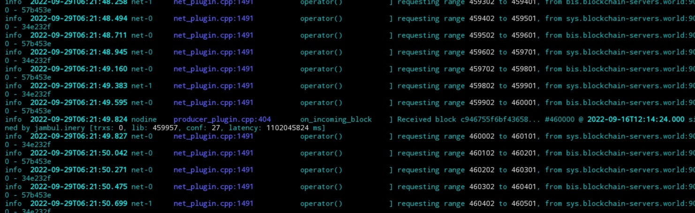
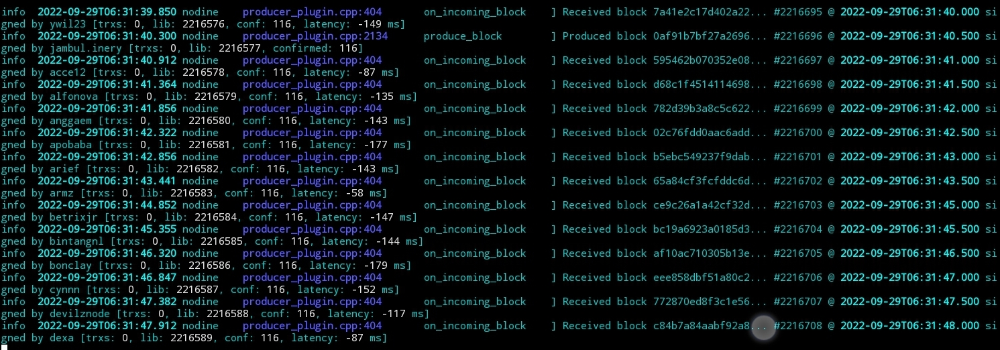
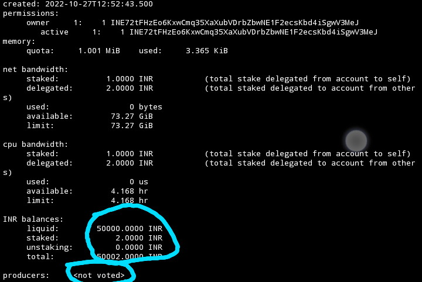
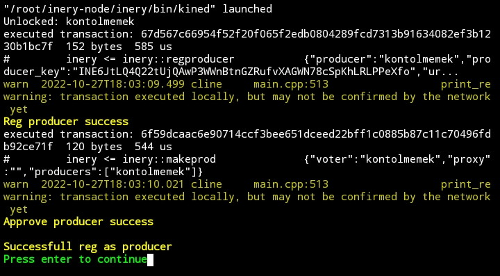
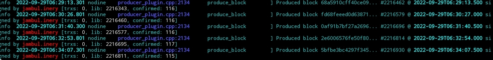

# Inery testnet master node guide installation

## Official Links
- [Official Docs](https://docs.inery.io/)
- [Inery Official Website](https://inery.io/)
- [Inery testnet dashboard](https://testnet.inery.io/dashboard)
- [Inery testnet explorer](https://explorer.inery.io)

Sebelum memulai pastikan sudah buat akun di https://testnet.inery.io
dan mengambil faucet yg paling bawah 500000 INR

## Auto install
```
sudo -i
wget -O $HOME/inery.sh https://raw.githubusercontent.com/jambulmerah/guide-testnet/main/inery/inery.sh && chmod 777 $HOME/inery.sh && bash $HOME/inery.sh
```
Pilih nomor 1 untuk install master node

### Pasca install
```
source $HOME/.bash_profile
```

### Mendapatkan info block
**1. Info block tertinggi saat ini**
```
curl -sSL -X POST 'http://bis.blockchain-servers.world:8888/v1/chain/get_info' -H 'Accept: application/json' | jq
```
**2. Info block di local node**
```
curl -sSL -X POST 'http://localhost:8888/v1/chain/get_info' -H 'Accept: application/json' | jq
```
## Check log
```
tail -f $inerylog | ccze -A
```
**1. Pertama anda akan melihat log yang seperti ini**



`Requisting range` artinya node sedang menyinkronkan block ini mungkin membutuhkun beberapa jam untuk mencapai blok sinkron penuh

**2. Anda akan melihat seperti ini jika block sudah full syncron**



`On_incoming block` dan `received block` artinya node sudah full syncron dan mulai menerima block baru
## Register dan approve master node ( TASK 1)

**1. Setelah block syncron penuh pastikan balance testnet dari faucet sudah masuk**
jalankan command:
```
cline get account $IneryAccname 
```


**2. Jika anda melihat gambar seperti di atas dengan balance liquid 50000 INR dan status producer `<not voted>`**
mari kita lanjutkan command:

```
bash $HOME/inery.sh
```
**- 3. Pilih no 3 `Reg/approve as producer`**

Kira kira hasilnya seperti ini jika sukses



**4. Untuk memastikannya jalankan command**

```
cline get account $IneryAccname 
```
Anda akan melihat status producer berubah dari produced `not voted` menjadi nama akun anda

**5. Cek log apakah akun node kita sudah mulai memproduksi block**

```
tail -f $inerylog | ccze -A | grep $IneryAccname
```
Setelah beberapa meneit anda akan melihhat akun anda mendapat giliran memproduksi block seperti gambar dibawah



**6. Sekarang tinggal login ke dashborad https://testnet.inery.io dan submit task 1**

good luck

## Usefull command
