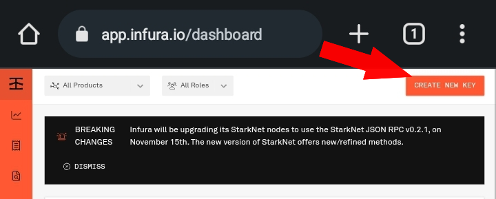
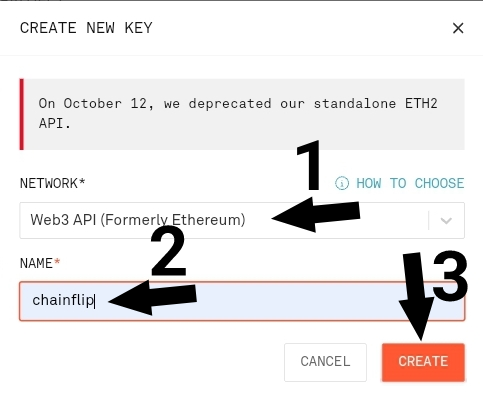
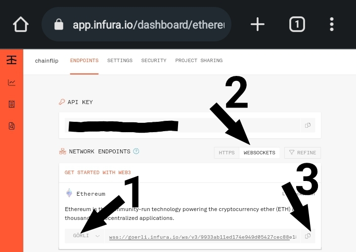

# Safestake galileo guide node operator and validator

# Official link
* Website: https://www.parastate.io/
* Twitter: https://twitter.com/parastateio
* Discord: http://discord.gg/zFS3Mnfpwj
* Doc instllation: https://github.com/ParaState/SafeStakeOperator
* Safestake dashboard: https://testnet.safestake.xyz
* Safestake explorer: https://explorer-testnet.safestake.xyz

# Usefull link
* Infura web3 endpoint: https://app.infura.io/dashboard
* Alchemu web3 endpoint: https://dashboard.alchemy.com
* Goerli launchpad validator: https://goerli.launchpad.ethereum.org/en/overview
* Goerli beacon explorer: https://prater.beaconcha.in

## Sebelum memulai Harus memiliki akun infura atau alchemy ethereum client api
Untuk saat ini kita menggunakan infura untuk ethereum clienntnya
#### 1. Buat akun atau login
**https://app.infura.io/dashboard**
**Contoh di sini saya menggunakan akun infura**
#### 2. Setelah masuk ke dashboard klik `Create new key`

#### 3. Isi nama dan pilih network Web3 API (Ethereum formerly) lalu klik create

#### 4. Pilih jaringan goerli dan koneksi websocket


## Deploy node operator safestake
###### Catatan: Untuk menjalankan validator client harus terhubung ke beacon-node consensus client seperti lighthouse yang telah disinkronkan sepenuhnya. Dan untuk menjalankan beacon node consensus client perlu terhubung ke execution client seperti geth yang telah syncron sepenuhnya
###### Catatan: Tapi disini kita tidak akan run geth execution dan lighthouse beacon-node consensus client
###### Catatan: Karna operator safestake validator clientnya dari lighthouse, Jadi kita hanya perlu menghubungkan operator ke beacon node consensus client yang sudah sinkron sepenuhnya, disini saya punya sekitar 18 peer beacon node lighthouse dengan versi yang sama dengan dvf validator client safestake, akan tetapi mungkin saja suatu saat salah satu atau semua peernya mati
#### 1. Buat direktori operator
```
sudo mkdir -p /data/operator

```

#### 2. Update upgrade package
```
sudo apt update && sudo apt upgrade -y

```

#### 3. Install docker 
```
sudo apt autoremove docker* container* -y
sudo apt install jq curl wget tar zip unzip -y
curl -sSL https://get.docker.com | bash -
sudo curl -SL https://github.com/docker/compose/releases/download/v2.14.2/docker-compose-linux-x86_64 -o /usr/local/bin/docker-compose
sudo ln -s /usr/local/bin/docker-compose /usr/bin/docker-compose
sudo chmod +x /usr/local/bin/docker-compose /usr/bin/docker-compose
sudo systemctl restart docker.service

```

#### 4. Buat konfigurasi docker compose
###### 1. Buat direktori safestake
```
mkdir -p $HOME/safestake

```

###### 2. Buat file docker-compose.yml
```
nano $HOME/safestake/docker-compose.yml

```

###### 3. Salin dan pastekan konfigurasi di bawah ini
```
version: '3'
services:
  operator:
    network_mode: "host"
    volumes:
      - operator-data:/root/.lighthouse
    image: parastate/dvf-operator:${IMAGE_TAG}
    pull_policy: always
    command:
      - /bin/sh
      - -c
      - |
        dvf validator_client --debug-level=info --network=${OPERATOR_NETWORK} --beacon-nodes=${bn} --api=${API_SERVER} --ws-url=${WS_URL} --contract-address=${CONTRACT_ADDRESS} --ip=$node_ip --boot-enr=${ENR} 2>&1
    expose:
      - "25000"
      - "25001"
      - "25002"
      - "25003"
      - "25004"

volumes:
  operator-data:
    driver: local
    driver_opts:
      o: bind
      type: none
      device: /data/operator
```

###### 4. Buat file env vars
```
nano $HOME/safestake/.env

```

###### 5. Salin dan pastekan variable di bawah ini, Isi variable "WS_URL=" dengan goerli websocket url dari infura atau alchemy
```
# Salin url goerli websocket dari infura atau alchemy dan isi di variable WS_URL=

WS_URL=

# Contoh:
# WS_URL=wss://eth-goerli.g.alchemy.com/v2/<YourApiToken>

ENR=enr:-IS4QJfrorMW3LPIYurVoNmN4L2E2pEdpS17jogfHLGlng7DSiZ12QE_I_KiefZViri0ar58gcIg5bI-lGVaRrYeQjgBgmlkgnY0gmlwhBKIH16Jc2VjcDI1NmsxoQPKY0yuDUmstAHYpMa2_oxVtw0RW_QAdpzBQA8yWM0xOIN1ZHCCIy0
GETH_NETWORK=goerli
LIGHTHOUSE_NETWORK=prater
OPERATOR_NETWORK=prater
IMAGE_TAG=staging
CONTRACT_ADDRESS=0x93Ec63F53Fd7362CEAb5A70F1c1B1BD5B49eeb81
API_SERVER=https://api-testnet.safestake.xyz/v1/collect_performance
TTD=10790000

node_ip=$(curl -s ifconfig.me)

bn="http://185.209.228.18:5052,http://45.8.132.141:5052,http://161.97.108.208:5052,http://65.108.124.25:5052,http://18.119.161.153:5052,http://75.119.154.128:5052,http://65.109.27.79:5052,http://194.242.57.111:5052,http://185.249.225.242:5052,http://213.136.86.80:5052,http://65.108.76.44:5052,http://194.5.152.78:5052,http://144.76.29.165:5052,http://83.171.248.177:5052,http://185.249.225.242:5052,http://194.242.57.133:5052,http://194.242.57.112:5052,http://20.226.4.4:5052"

```

#### 4. Run operator
```
cd $HOME/safestake
sudo docker-compose up -d

```

#### 5. Check log
```
cd $HOME/safestake
sudo docker-compose logs -f

```

## Daftarkan operator di web safetake
#####  Get node public key
Jalankan command di bawah dan copy outputnya, ini adalah node publik key anda
```
jq -r '.name' /data/operator/prater/node_key.json

```
##### Buka web di browser yang mempunyai ektensi metamask, terus konekin wallet ke jaringan goerli, pilih register operator isi node publik key sama nama operatornya,  webnya:

https://testnet.safestake.xyz
##### Kalo udah register operator, backup node keynya, jalankan command di bawah lalu copy semua outputnya dan simpan
```
cat /data/operator/prater/node_key.json | tr -d "\n " | sort

```
### Selamat anda sudah menjalankan operator di safestake
### Status operator tidak akan aktif sebelum ada validator yang menggunakan operator anda
## Jalankan validator di safestake
##### 1. Untuk membuat validator goerli anda harus mempunyai goETH, 32 goETH/validator. Anda dapat memintanya di discord parastate
https://discord.com/channels/769941371581890580/1007516968229814372/1054425618860757023
##### 2. Download staking deposit cli

```
wget https://github.com/ethereum/staking-deposit-cli/releases/download/v2.3.0/staking_deposit-cli-76ed782-linux-amd64.tar.gz -O $HOME/staking-deposit.tar.gz
tar -xzvf $HOME/staking-deposit.tar.gz
rm -f $HOME/staking-deposit.tar.gz
mv $HOME/staking_deposit-cli-76ed782-linux-amd64 $HOME/staking-deposit

```

##### 3. Buat keystore dan staking deposit
```
$HOME/staking-deposit/deposit --language "Bahasa melayu" new-mnemonic --mnemonic_language English --chain goerli

```

##### 4. Karna saya install staking deposit cli di vps jadi perlu membackup folder keystorenya, jika anda menginstall nya di mesin lokal anda anda bisa melewati langkah ke 4 dan ke 5
```
cd $HOME
zip -r validator_keys.zip validator_keys

```

##### 5. Upload keystore ke web transfer.sh lalu salin link yang di berikan oleh transfer.sh kemudian pastekan dan download di browser anda, setelah itu extract file zipnya, yg didalamnya ada file deposit data dan keystore yg berektensi json
```
cd $HOME
curl --upload-file validator_keys.zip https://transfer.sh

```

##### 6. Buka website launchpad ethereum goerli di browser, Klik continue dan continue ae sampe dibagian upload keystore, disitu silahkan upload file deposit data yg berektensi jsonn, dan lakukan deposit menggunakan goETH. 32 gETH per validator/keystorenya.
* Goerli launchpad validator: https://goerli.launchpad.ethereum.org/en/overview

##### 7. Setelah melakukan deposit, daftarkan validator anda di web dashboard safestake, upload validator keystore anda lalu pilih operator anda dan 3 operator lainnya untuk mulai mengoperasikan validator anda, pastikan 3 operator lainnya dalam keadaan aktif, Anda bisa mengeceknya di explorer safestake
* Safestake dashboard: https://testnet.safestake.xyz
* Safestake explorer: https://explorer-testnet.safestake.xyz/operators

##### 8. Validator anda akan aktif di beacon node setelah deposit dan menunggu 14-24 jam, jika validator sudah aktif dibeacon node, cek operator anda di safestake explorers
* Safestake explorer: https://explorer-testnet.safestake.xyz/operators
# Dah segitu aja maaf kalo tutornya membingungkan 😆
## Script auto refresh peers dan auto restart jika node stuck
```
cd $HOME/safestake
touch refresh_peers.sh
chmod +x refresh_peers.sh
nano refresh_peers.sh

```

## Tempel SCnya
```
#!/bin/bash
cd $HOME/safestake
activePeers(){
    source .env
    peer_list=(`echo -n $bn | tr "," " "`)
    list=${#peer_list[@]}
    echo -e "Total active peers: $list\t✅️"
}
restartNode(){
    check_log=$(docker-compose logs --since 5m | tail -1)
    if [[ -z ${check_log} ]]; then
        sudo docker-compose down && sudo docker-compose up -d
        echo Node restared
    fi
}

while true; do
    source .env
    echo -e "\nFetching peers"
    current_peer=(`echo -n $bn | tr "," " "`)
    for (( x=0; x<${#current_peer[@]}; x++ )); do
        if [[ ! $(curl -s --connect-timeout 0.25 ${current_peer[$x]} 2>&1) ]]; then
            echo -e "\nDeleting inactive peers"
            source .env
            if [[ $(grep -ow `echo -n ${current_peer[$x]},` .env) ]]; then
                sed -i 's|'${current_peer[$x]}'||' .env
            else
                sed -i 's|'${current_peer[$x]}',||' .env
            fi
            echo -n -e "Peer: ${current_peer[$x]} deleted\t❌\t️"
            activePeers
            echo -e "\nFetching peers"
        fi
        active_peer=(`echo -n $bn | tr "," " "`)
        peers=(`curl -s ${active_peer[$x]}/lighthouse/peers/connected | jq -r '.[].peer_info | select(.client.kind=="Lighthouse") | select(.client.version=="v3.1.0-aa022f4") | .seen_addresses[]' | sed 's|:.*|:5052|g' | awk '{print "http://"$0}' | awk '!seen[$0]++'`)
        for (( i=0; i<${#peers[@]}; i++ )); do
            if [[ $(curl -s --connect-timeout 0.25 ${peers[$i]} 2>&1) ]]; then
                if [[ $(curl -s ${peers[$i]}/lighthouse/syncing | jq -r '.data') == "Synced" ]]; then
                    if [[ ! $(grep -ow `echo -n ${peers[$i]}` .env 2>&1) ]]; then
                        sed -i 's|bn=.*|bn='$bn','${peers[$i]}'|g' .env
                        echo -n -e "New peer: ${peers[$i]} \t✅️\t"
                        activePeers
                    fi
                fi
            fi
        done
    done; restartNode
done >refresh_peers.log 2>&1 &
```

## Run SCnya
```
cd $HOME/safestake
./refresh_peers.sh

```

## Cek lognya
```
cd $HOME/safestake
tail -f refresh_peers.sh

```

